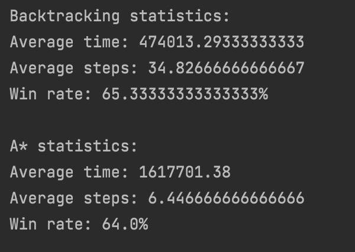

# PEAS for the program’s System:

### Performance:
  Win rate, survivability, possible walkthrough optimization, getting to the exit with the book (completing the task), speed

### Environment: 
  A 9x9 map with 2 enemies with 5x5 (Filch) and 3x3 (Ms. Norris) danger zones, 1 invisibility cloak, 1 book and 1 exit.

### Actuators: 
  Harry can move by 1 cell at any direction

### Sensors: 
  Harry can see cells around in one of 2 possible modes (perception types), also given rules don’t prohibit memorizing cells along the trial path, so Harry posseses   the map, by means of which he can avoid some obstacles (might be crucial for 2nd perception type). As of the code, those are methods like inDangerZone(cell) and     different map checks

### Backtracking:
  At first it’s a classical backtracking algorithm implemented by means of DFS. Harry picks some cell from those that are available around, goes there and does so     until he gets to the book or has no cell to go to. In that case he backtraces his way to the last cell he had some options to go to at. Continues movement unless   there’s no cell with options to move to or he gets to the book.
  As it gets to the book, it starts from the beginning and goes to it knowing where it is, choosing each next cell as the closest one from available cells. After     that Harry does the same, but towards the exit.

### A\*:

It’s classical BFS based algorithm implementation with at first random destination that randomizes until Harry accidentally finds the book. After that, Harry starts from initial point, then he fills priority queue PQ with it’s neighbours, then moves into the one with the smallest cost (Cost = Distance + Heuristic; Heuristic = sqrt((dX)^2+(dY)^2)), adds its neighbour cells into PQ and again chooses a cell with the smallest cost. Continues until he reaches the book and then the exit.

- Backtracking (variant 1) compared to A\* algorithm (variant 1)

- Backtracking (variant 2) compared to A\* algorithm (variant 2)

- Backtracking (variant 1) compared to A\* (variant 2)

- A\* algorithm (variant 1) compared to Backtracking algorithm (variant 2)

